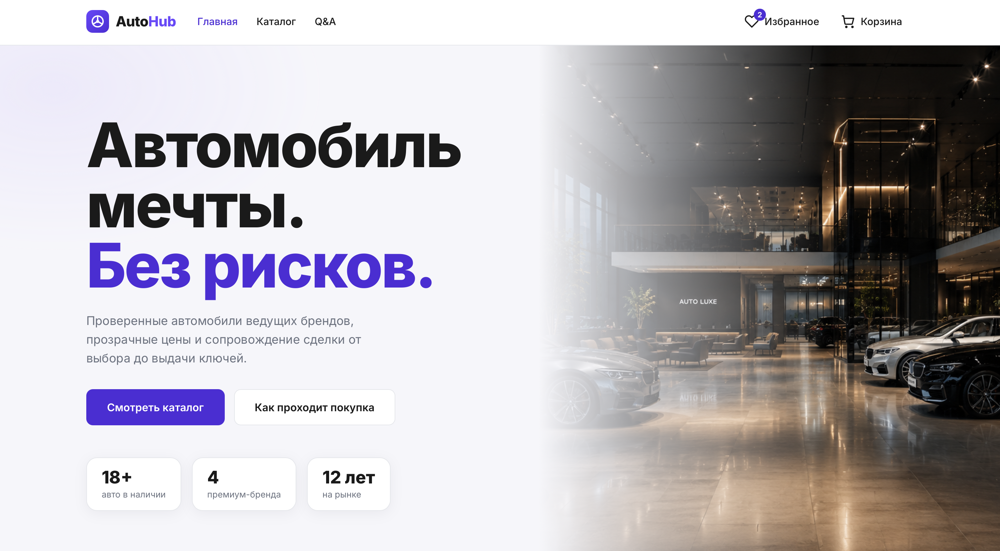
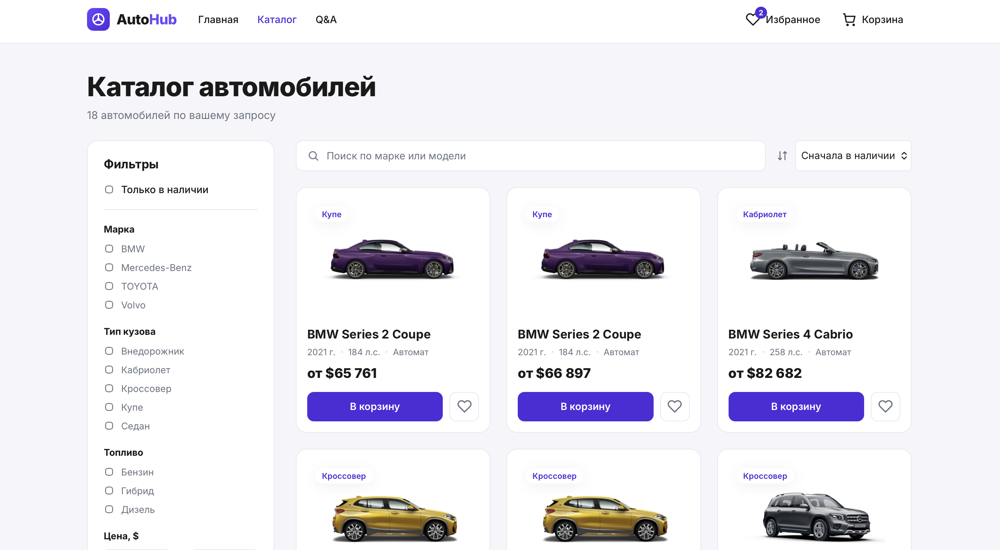
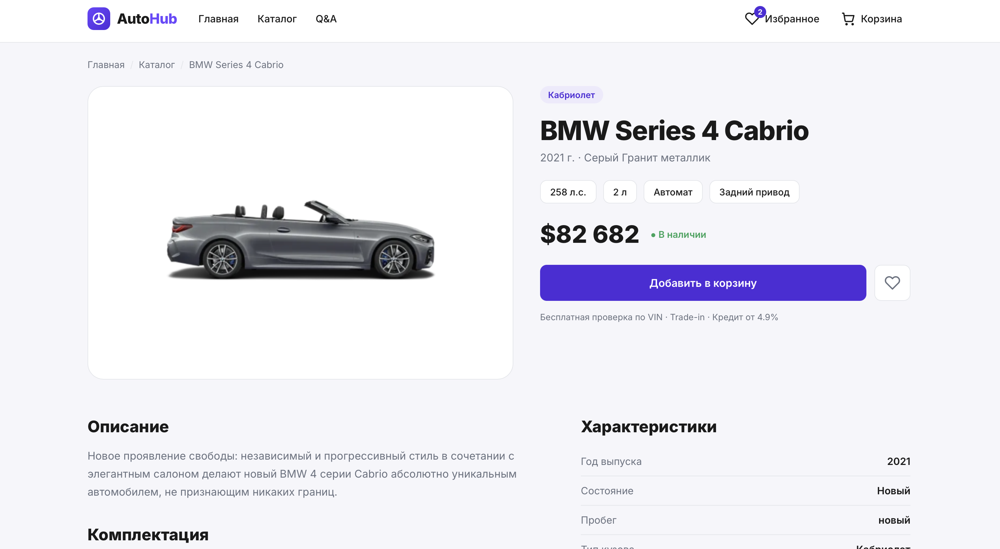
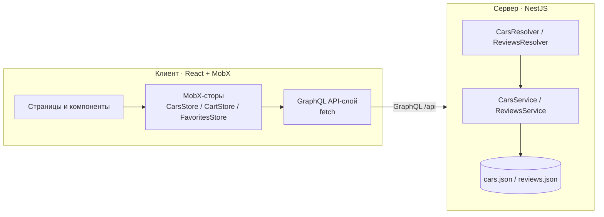

# 🚗 AutoHub — интернет-магазин автомобилей

### 🔗 Живое демо: **[autohub-1jyg.onrender.com](https://autohub-1jyg.onrender.com)**

Полнофункциональный fullstack-магазин автомобилей: витрина автосалона с лендингом,
каталогом с фильтрами, страницами автомобилей, избранным, корзиной и оформлением заказа.

> ⏳ Демо на бесплатном тарифе Render — если сервис «спал», первый заход грузится ~30–50 с.

> Проект вырос из тестового задания (каталог на одной странице) в полноценный
> «магазин»: маршрутизация, серверная фильтрация и пагинация, воронка покупки от
> карточки до подтверждённого заказа.

[](https://github.com/IlyaSveshnikov/car-shop/actions/workflows/ci.yml)


**Деплой:** проект развёрнут одним сервисом (NestJS отдаёт API и собранный клиент).
Пошаговый гайд — [DEPLOY.md](DEPLOY.md) (Render one-click / Docker).

## 📸 Скриншоты

<!-- Запустите приложение и положите скриншоты в docs/, затем раскомментируйте: -->
<!--  -->
<!--  -->
<!--  -->

Главная (hero, преимущества, подборка, отзывы) · Каталог с фильтрами · Страница
автомобиля · Корзина и оформление заказа.

## ✨ Возможности

- **Лендинг** — hero-блок, преимущества («почему нам доверяют»), подборка популярных
  моделей, шаги покупки и отзывы клиентов.
- **Каталог** — серверная фильтрация (марка, кузов, топливо, цена, год, наличие),
  сортировка (7 режимов) и пагинация «показать ещё».
- **Страница автомобиля** — галерея, полные характеристики, комплектация, похожие
  автомобили (`car(id)` + `similarCars`).
- **Избранное** — сохранение понравившихся авто с персистом в `localStorage`.
- **Корзина и оформление** — количество, итоговая сумма, форма заказа с валидацией и
  экраном подтверждения. Корзина переживает перезагрузку страницы.
- **Отзывчивый интерфейс** — адаптив под мобильные, скелетоны загрузки, состояния
  ошибок и пустых списков, доступность (aria-атрибуты, семантика).

## 🧱 Стек

**Клиент:** React 18, TypeScript, Vite, MobX (`mobx-react-lite`), Emotion (CSS-in-JS),
React Router 6.

**Сервер:** NestJS 9, GraphQL (Apollo, code-first), TypeScript. Данные — статический
JSON (без БД, чтобы проект запускался одной командой). Jest + Supertest для тестов.

## 🗺️ Архитектура



- **Клиент**: страницы (`pages/`) и переиспользуемые компоненты (`components/`)
  работают с состоянием через MobX-сторы. Сеть изолирована в API-слое (`api/`).
- **Сервер**: классический для NestJS модуль/резолвер/сервис. Фильтрация, сортировка
  и пагинация выполняются на сервере через GraphQL-аргументы.

## 📁 Структура

```
CarShop/
├─ client/                 # React + Vite
│  └─ src/
│     ├─ api/              # GraphQL-запросы (клиент + операции)
│     ├─ components/       # UI-компоненты (карточки, фильтры, навбар, ui/)
│     ├─ hooks/            # useAsync
│     ├─ pages/            # Home, Catalog, CarDetails, Cart, Checkout, ...
│     ├─ stores/           # MobX: RootStore, CarsStore, CartStore, FavoritesStore
│     ├─ styles/           # токены темы, глобальные стили
│     └─ types/ utils/
└─ server/                 # NestJS + GraphQL
   └─ src/
      ├─ cars/             # entity, resolver, service, dto, cars.json
      └─ reviews/          # отзывы клиентов
```

## 🚀 Быстрый старт

Нужен Node.js 16+.

**1. Сервер** (GraphQL API на http://localhost:4000/api):

```bash
cd server
npm install
cp .env.example .env
npm run start:dev
```

**2. Клиент** (в отдельном терминале, http://localhost:3000):

```bash
cd client
npm install
npm start
```

Vite проксирует `/api` и `/static` на сервер, поэтому CORS не требуется. GraphQL
Playground доступен на http://localhost:4000/api.

## 🔌 GraphQL API

| Запрос | Описание |
| --- | --- |
| `cars(filter, sort, limit, offset)` | Каталог с фильтрами, сортировкой и пагинацией → `{ items, total }` |
| `car(id)` | Автомобиль по id (для страницы автомобиля) |
| `similarCars(id)` | Похожие авто той же марки/кузова |
| `carFacets` | Доступные значения фильтров и диапазоны цен/годов |
| `reviews` | Отзывы клиентов для главной |

Пример:

```graphql
query {
  cars(filter: { brands: ["BMW"], onlyAvailable: true }, sort: PRICE_DESC, limit: 6) {
    total
    items { id brand model priceValue bodyType }
  }
}
```

## ✅ Тесты и сборка

```bash
# сервер
cd server
npm test            # юнит-тесты сервиса (фильтры/сортировка/пагинация)
npm run test:e2e    # e2e-тесты GraphQL API
npm run build

# клиент
cd client
npm run build       # tsc + vite build
```

## 🧭 Возможные улучшения

Реальная БД (Postgres + Prisma) вместо JSON · авторизация и личный кабинет ·
кредитный калькулятор и запись на тест-драйв · сравнение авто · CI (GitHub Actions) ·
Docker Compose для запуска одной командой.

## 📄 Лицензия

MIT.
